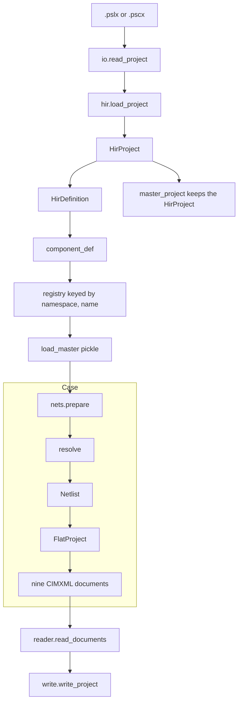

# Architecture

`pscx-cim` reads a PSCAD 5.0 `.pscx` case and the `.pslx` libraries it names, reconstructs the electrical netlist and the data-signal graph, and writes nine CIMXML documents. `pscx read` builds a `.pscx` back from those documents.

`master.pslx` stays outside the repository. `PSCAD_MASTER` points at it.

## One reader

`pscx.io.read_project` is the only reader of a `.pscx` or a `.pslx`. It calls `pscx.hir.load_project` and discards the unrecognized-element report, because elements a library carries that the reader does not model are not findings against the case. The file becomes one `HirProject`. An `HirProject` retains the lxml tree, so every caller copies out what it needs and drops the project.

| XML | Class |
|---|---|
| root | `HirProject` |
| `<paramlist>` | `HirParams` |
| `<Layer>` | `HirLayer` |
| `<GlobalSubstitutions>`, `<List>`, `` | `HirSubstitutions`, `HirSubstitutionList`, `HirSubstitution` |
| `<Definition>` | `HirDefinition` |
| its `<form>` | `HirFormCategory`, `HirFormParameter` |
| its `<Port>` | `HirPort` |
| its `<segment>` | `HirSegment`, text plus a guard tree |
| its `<schematic>` | `HirCanvas` of `HirComponent` and `HirWire` |
| graphics, help, choice lists | `Opaque` |

An element the reader does not model becomes an `Unrecognized` entry. `read_project` discards these entries. To list them for one file, call `pscx.hir.load_project` directly or run `tools/unrecognized.py`.

## The lowering

`component_def` lowers each `HirDefinition` into a frozen `ComponentDef`: `PortDef` ports, `FormParameterDef` rows, defaults, units, `#OUTPUT` writer directives, `BranchDecl` lines, computations text, model-data text, and the guard trees. The form title, the port ids, and the opaque fragments stay on the `HirDefinition`.

`register_definitions` keys the registry by `(namespace, name)`. The namespace is the project's declared name, or the filename stem when the file states none, so a case-local `resistor` cannot hide `master:resistor`.

`load_master` does this for `PSCAD_MASTER` and pickles the registry. The pickle holds no elements. `master_project` is the uncached read that keeps the `HirProject`, for a caller that needs the English form title, the group, or an opaque fragment.

## A case

`nets.prepare` copies `load_master()`, overlays the case's own definitions, and loads every sibling `*.pslx` plus every workspace filepath into the same registry. `netlists_of` walks each definition that has a schematic. `resolve` looks up `namespace:name`, then a bare name. A placement becomes a `Component` with canvas-space `Port`s. Wires become segments and hosted `Device`s. The canvas becomes a `Netlist` of `Node`s and `SignalNet`s.

`elaborate.flatten` stacks those netlists into a `FlatProject` of `Instance`s. Instances of one canvas share their `Component` objects, so a placement is `(instance index, component address)`.

`pscx.cim.emit_files` writes the nine documents from the `FlatProject`. Every drawn placement is a `cim:DetailedModelDynamics` in the EMT document, naming one shared `emt:LibraryModelType`. What a parameter is belongs on a `cim:ParameterDescriptor` of that type. What this placement sets it to is a `cim:ParameterValue`. Kinds in the rule tables are also standard equipment in EQ, TP, SC, SSH, and OP. The join from a case to a library is `(modelingTool, toolVersion, definitionName)`.

[Documents](../documents.md) states which document carries which field.

## The way back

`pscx.reader.read_documents` decodes a document set into an `HirProject`. `read_case` refuses a set that disagrees with its own re-emission unless a precedence is chosen. `pscx.write.write_project` serializes that project to `.pscx`. `pscx.check.check_documents` reports the disagreement and repairs nothing.

Each inverse sits beside what it inverts. `pscx.emission` holds the projection pair. `pscx.dl`, `pscx.surface`, and `pscx.record` each hold the inverse of their own document. `pscx.rules` holds the tables `reconstruct` reads. The field-by-field list of what the exchange must carry is `tests/test_reconstruction_inventory.py`.
