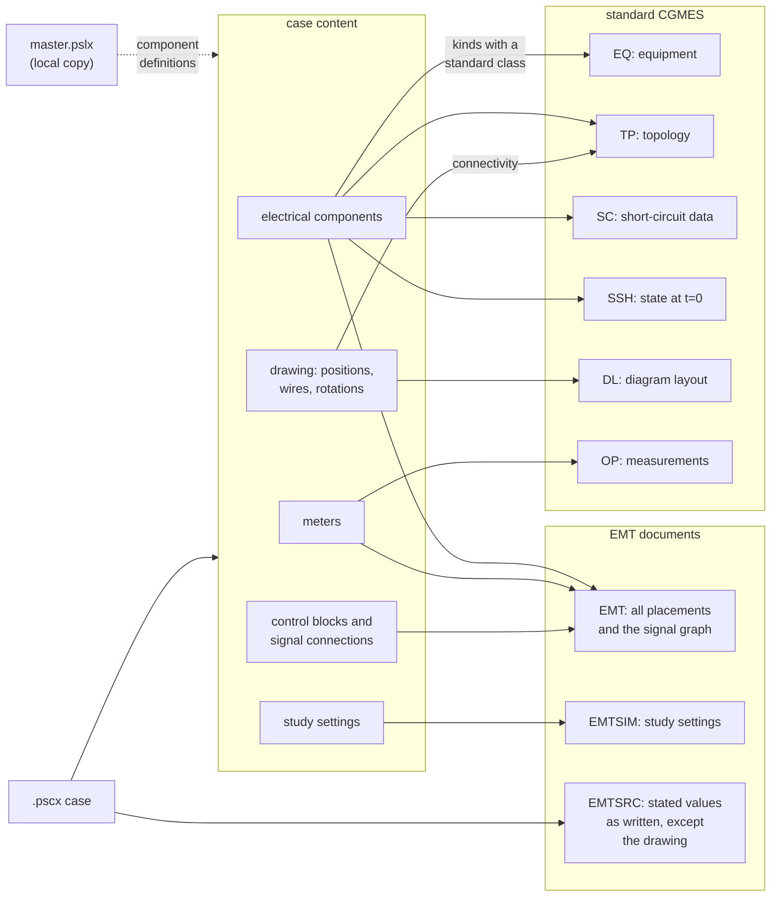

# Documents

`pscx emit CASE --out DIR` writes nine documents for one case.

The diagram shows the document that receives each part of a case.
Every placement is written to the EMT document. A component whose kind
has a standard CIM class is also written to the standard documents.
With `--no-add-on`, the three EMT documents are omitted and six
documents are written. With `--no-source`, EMTSRC alone is omitted and
eight are written.

| document | file suffix | content |
|---|---|---|
| EQ | `_EQ.xml` | equipment: the part of the network that maps to standard classes (CGMES 3.0 Equipment profile) |
| TP | `_TP.xml` | topology: connectivity and topological nodes |
| SC | `_SC.xml` | short-circuit data: zero-sequence impedances |
| SSH | `_SSH.xml` | steady-state hypothesis: states and injections at t=0 |
| OP | `_OP.xml` | operation: the measurement points (`cim:Analog`) |
| EMT | `_EMT.xml` | every drawn placement as a `cim:DetailedModelDynamics` with its evaluated parameters, the signal graph, declared ports and right-of-way records |
| EMTSIM | `_EMTSIM.xml` | the study: solver settings as an `emt:SimulationCase` |
| EMTSRC | `_EMTSRC.xml` | the source record: every value the case states, as written. It is the statement of record for everything except geometry. |
| DL | `_DL.xml` | diagram layout: positions, vertices and rotations. It is the statement of record for geometry. |

This guide refers to EQ, TP, SC, SSH and OP as **the standard five**.
The *statement of record* for a quantity is the one document in which
that quantity is authoritative; [Edits](edits.md) describes how edits
depend on it.

## Standard documents and EMT documents

The standard documents describe the network as CGMES defines it, for
steady-state and short-circuit studies. Standard CIM has no class for a
control block or for the signal connections between blocks, so control
systems appear only in the EMT document, as placements joined by
`emt:SignalNet` subjects. Components whose kind has no standard class
also appear only in the EMT document, and every placement there states
its parameters as the case states them. EMTSIM carries the solver
settings.

An EMT simulation therefore requires the EMT and EMTSIM documents
alongside the standard five. A steady-state study requires the standard
documents alone, which is the set `--no-add-on` writes.

## Who reads what

| reader | standard five | DL | EMT | EMTSIM | EMTSRC |
|---|---|---|---|---|---|
| EMT simulator | required | optional, for network diagrams | required | required | not used |
| steady-state consumer, such as a CGMES load-flow tool | required | optional, for network diagrams | not used | not used | not used |
| `pscx read`, which rebuilds the `.pscx` | required | required | required | required | required |

**EMT simulator.** Every quantity a simulation uses is stated in the
standard five, EMT or EMTSIM, so EMTSRC is not required.

**Steady-state consumer.** PowSyBl reads a full set and ignores the EMT
documents. A consumer that rejects the `emt:` profile, such as
pandapower's `cim2pp`, requires a set written with
`pscx emit --no-add-on`.

**`pscx read`.** A set with any document missing is rejected. The case
is reconstructed from EMTSRC, DL and EMTSIM, and the remaining
documents are compared with their re-emission, the same comparison
`pscx check` performs. The local `master.pslx` is also required,
because the exchange names library models without copying their
implementations (see [Limits](limits.md)).

## Reading the documents

Every document is CIMXML (RDF/XML). Each subject is a `urn:uuid:` IRI,
and its mRID is stated as `cim:IdentifiedObject.mRID`. The documents of
one set refer to each other through these IRIs.

The `emt:` namespace is `https://w3id.org/pscx-cim/ns/CIM/EMT#`. Its
terms are declared in `src/pscx/profiles/emt/EMT-AP-Voc-RDFS.rdf`, its
constraints in `EMT-AP-Con-SHACL.ttl`, and a readable index is in
`EMT.md` in the same directory. These URIs are identifiers and do not
resolve as web addresses (see [Limits](limits.md)).
