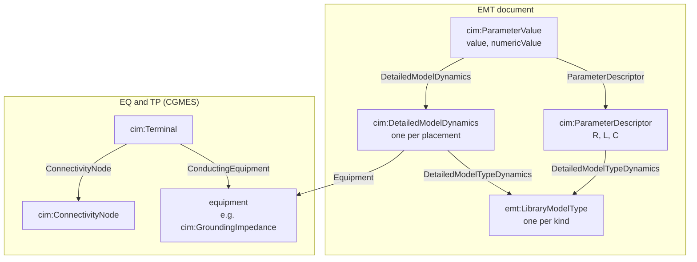

# Mapping

```{toctree}
:hidden:

generated/kind-to-cim
generated/statement-of-record
```

This chapter describes how PSCAD's vocabulary is written in CIM. Both
tables it links to are generated from the code's rule tables, and the
guide build fails if either is out of date.

## Kinds

Every drawn placement, of every kind, is written to the EMT document
as a `cim:DetailedModelDynamics` that names its library type. The
kinds listed in the [kind table](generated/kind-to-cim.md) are *also*
written to the standard five. That second copy is what a standard-only
consumer, such as a load-flow tool reading CGMES, sees.

A kind that is not in the table is not lost. It is exchanged by name
and parameters in the EMT document, and your engine supplies the
implementation from its own library.

## The three vocabulary tiers

Everything the exchange states belongs to one of three nested
vocabularies. The tier tells you which tools can read a statement.

1. **Standard CGMES**: the standard five (EQ, TP, SC, SSH, OP). Any
   CIM tool reads this tier without knowing anything about this
   project. Only the kinds in the [kind table](generated/kind-to-cim.md)
   appear here.
2. **The published `emt:` extension**: the EMT, EMTSIM and EMTSRC
   documents. Every drawn placement appears here as a
   `cim:DetailedModelDynamics` with its evaluated parameters. The
   vocabulary is declared in the shipped profile, so any consumer that
   loads the profile can read this tier in full.
3. **Verbatim tool payloads**: `emt:ToolPayload` statements that keep
   source fragments byte for byte, such as choice lists and script
   bodies. They travel inside tier 2 with a name and a position, but
   only PSCAD's own rules can interpret their content.

Each statement is written in the first tier that can express it. A
statement that no standard class can hold goes to the extension, and
a fragment the extension has no term for is kept verbatim as a tool
payload.

## What one mapped placement becomes

The class named in the kind table is one of several subjects written
for a placement. The diagram shows them for a mapped placement:



A mapped R, L or C placement, for example, becomes:

- the equipment subject itself, with its `cim:Terminal`s and topology
  in EQ and TP. For a `cim:GroundingImpedance`, the impedance values go
  in SC, because a neutral grounding impedance is short-circuit data,
  not load-flow data;
- one `cim:DetailedModelDynamics` in the EMT document, linked to the
  equipment by `cim:DetailedModelDynamics.Equipment`;
- one `emt:LibraryModelType` per kind, shared by every placement of
  that kind. It carries three `cim:ParameterDescriptor`s, R, L and C,
  with declared units ohm, H and uF;
- one `cim:ParameterValue` for each quantity the form states, holding
  the evaluated number in the declared unit.

A consumer reading EQ alone sees the load-flow view. Reading the EMT
document as well recovers the primitive quantities as the case states
them.

## How values convert

Every impedance is written in two forms, each with its own rule:

- **The standard documents include ω.** EQ states reactance as
  `x = ωL`. A shunt capacitor's `bPerSection` is `+ωC`, a shunt
  reactor's is `−1/ωL`, and a shunt resistor states its conductance as
  `gPerSection = 1/R`. The class and sign for each grounding role are
  in the [kind table](generated/kind-to-cim.md).
- **The EMT document is verbatim.** R, L and C are written as stated,
  in the declared unit. A capacitance entered in uF stays that uF
  number and is not converted. A reader converts by the stated unit,
  so a document whose unit and number disagree reads back wrong; it is
  not corrected.
- **No frequency, no ω.** When a case does not determine a system
  frequency, the attributes that need ω are written as `0.0`, and a
  placeholder diagnostic counts each one. The verbatim values in the
  EMT document remain correct at any frequency. When both forms exist,
  `x` equals `ωL`, and the test suite checks the identity.

## The library join

A placement names its type with three literals, which together form
the join key:

- `emt:LibraryModelType.modelingTool` (always `PSCAD` here)
- `emt:LibraryModelType.toolVersion`
- `emt:LibraryModelType.definitionName` (qualified, as `library:name`)

Resolve them against your own `master.pslx`. The join does not use
mRIDs: an mRID is stable within one emission and has no meaning across
libraries.

## Statements of record

The [statement-of-record table](generated/statement-of-record.md)
lists every field of the source model and the document that carries
it. The [edit contract](edits.md) is built on that table: an edit
survives when, and only when, it is made in the field's own document.
