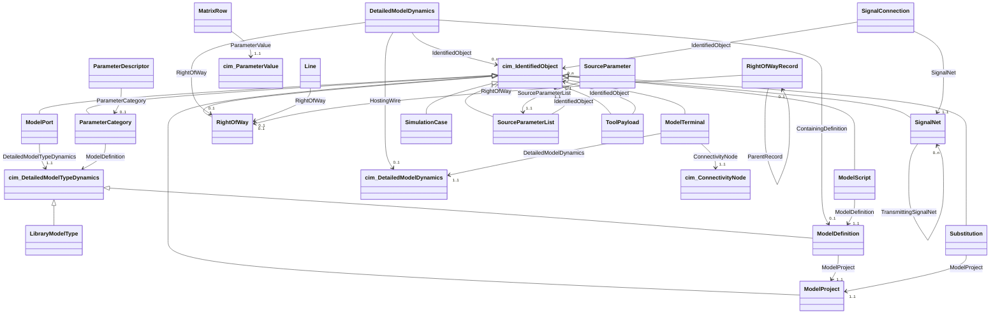

# EMT Extension Vocabulary

<!-- GENERATED by tools/dump_profile.py --markdown; do not edit by hand. -->

- **versionIRI**: https://w3id.org/pscx-cim/ns/CIM/EMT/1.0
- **keyword**: EMT
- **title**: EMT Extension Vocabulary
- **identifier**: 0c2f9de2-6ad4-5a52-8d6a-1b0e9f4c8e21
- **versionInfo**: 1.0.0
- **conformsTo**: urn:iso:std:iec:61970-600-2:ed-1

Electromagnetic-transient (EMT) modeling data that standard CGMES has no class for, exchanged as an add-on profile. A component with no standard class is exchanged as a standard cim:DetailedModelDynamics placement of a model type defined in this profile. The type describes the parameters once, and each placement states their values. The profile covers what standard CIM cannot state: the type of a tool library definition, the connection of such a model to individual conductors, the number of conductors at a node, and the evaluated number of a stated parameter. A second group of terms describes the design as an engineer edits it, rather than the network it solves: the definitions a case carries, their scripts and form groups, the hierarchy of placements, and the project-level substitutions that parameter expressions reference. Study settings have their own class and are never stated on equipment.

## Class diagram

## Classes

### `LibraryModelType` (concrete, subClassOf `DetailedModelTypeDynamics`)

A model type defined in a modeling tool's own library, such as a component of the PSCAD master library. Every placement of that library definition is a cim:DetailedModelDynamics that references this type. The parameters are described once on the type, as cim:ParameterDescriptor children, instead of on every placement. If the source states no definition for a placement, the placement gets a type of its own.

| property | type | multiplicity | kind |
|---|---|---|---|
| `definitionName` | `String` | 1..1 | attribute |
| `modelingTool` | `String` | 1..1 | attribute |
| `toolVersion` | `String` | 0..1 | attribute |

- **definitionName**: The fully qualified name of the definition in the tool's library, for example master:peswitch. A consumer needs this name, modelingTool and toolVersion to interpret the parameter list.
- **modelingTool**: The tool whose library defines the type, for example PSCAD. The tool is named in this attribute and not in the namespace, so that the class does not depend on any one tool and can be adopted by a standard.
- **toolVersion**: The version of the tool's library, if the source states one. A parameter list can only be interpreted against the library version that defines it.

### `MatrixRow` (concrete, subClassOf `-`)

One row of a matrix-valued parameter, as the verbatim text of that row. A stated parameter can have child content in the source file, and matrix rows are the only part of it kept as data. The rest is editor bookkeeping. The rows are needed because the source tool reads a matrix with no rows as a disabled coupling. That changes the network without changing the netlist, since matrix contents do not appear in the netlist. Like cim:ParameterValue, a row is not an IdentifiedObject. It is identified by its value and its position.

| property | type | multiplicity | kind |
|---|---|---|---|
| `ParameterValue` | `ParameterValue` | 1..1 | association |
| `sequenceNumber` | `Integer` | 1..1 | attribute |
| `value` | `String` | 1..1 | attribute |

- **ParameterValue**: The parameter value this row belongs to. The value keeps its own text as the source states it, which is a dimension declaration if the source declares one. The rows are stated alongside the value and do not replace it. A consumer that reads only the value sees the source file's attribute, and a consumer that also reads the rows sees the matrix.
- **sequenceNumber**: The position of the row within its matrix, counting from 1, in the order the source wrote it. Reordering the rows changes the matrix, so the order is stated explicitly.
- **value**: The row's entries as one uninterpreted string, verbatim. The row is kept as text and not parsed into numbers, because the source tool defines the row syntax and converting back must reproduce the exact source text.

### `ModelDefinition` (concrete, subClassOf `DetailedModelTypeDynamics`)

A model type whose body is carried in the exchange itself, such as a module that a case defines. Like emt:LibraryModelType, it is a subclass of cim:DetailedModelTypeDynamics. The two differ in where the body is kept. A library type is only named, and the receiving tool looks it up in a library it already has. A model definition is sent with its script, its form and its page, because the receiving side has no copy of it. A placement of either kind is an ordinary cim:DetailedModelDynamics that references its type through the standard association, so a consumer resolves both in the same way. As a result, a subcircuit used several times is exchanged as several placements of one definition, not as copies. Expanding the copies gives the same numerical results but loses the structure of the design.

| property | type | multiplicity | kind |
|---|---|---|---|
| `ModelProject` | `ModelProject` | 1..1 | association |
| `definitionName` | `String` | 1..1 | attribute |
| `group` | `String` | 0..1 | attribute |

- **ModelProject**: The project that contains this definition. Only this direction is written, and the inverse role is not declared.
- **definitionName**: The name that placements use to reference this definition, qualified in the same way as LibraryModelType.definitionName. Both type classes state this name explicitly, instead of relying on IdentifiedObject.name, so that one rule resolves a placement's type for either class.
- **group**: The library group the source files this definition under, verbatim and including blanks, if the source states one. An empty group and a missing group come from different source files and are kept distinct. The text organises the receiving tool's component palette and is not used to resolve anything.

### `ModelPort` (concrete, subClassOf `IdentifiedObject`)

A connection point that a definition declares. Every placement of the definition connects through the same ports. It is the type-level counterpart of emt:ModelTerminal. A terminal belongs to one placement and names a node of the equipment document. A port belongs to the type, names no node, and exists even if the definition is never placed. Standard CIM has no class for this: cim:Terminal requires conducting equipment, cim:SignalDescriptor requires a cim:ACDCTerminal, and a control input has neither. Ports are needed to rebuild the control network, because signals pass from one page to another through declared ports.

| property | type | multiplicity | kind |
|---|---|---|---|
| `DetailedModelTypeDynamics` | `DetailedModelTypeDynamics` | 1..1 | association |
| `condition` | `String` | 1..1 | attribute |
| `dataType` | `String` | 1..1 | attribute |
| `dimension` | `String` | 1..1 | attribute |
| `electricalType` | `String` | 1..1 | attribute |
| `internal` | `Boolean` | 1..1 | attribute |
| `mode` | `String` | 1..1 | attribute |
| `portName` | `String` | 1..1 | attribute |
| `sequenceNumber` | `Integer` | 1..1 | attribute |
| `sourceIdentifier` | `String` | 0..1 | attribute |

- **DetailedModelTypeDynamics**: The type that declares this port. The range is cim:DetailedModelTypeDynamics, the standard superclass of both type classes in this profile, so a port can be declared on either. On an emt:LibraryModelType in an interchange document, a simulation engine reads the ports to learn what a placement's connections are. On an emt:ModelDefinition in a source document, a reader uses them to rebuild the definition's drawn interface. One association serves both cases, so a consumer finds a port's owner in the same way in any document.
- **condition**: The condition on the type's parameters under which this port exists, verbatim in the source tool's expression language. A type can declare alternative versions of one port behind conditions that exclude each other, so a port list read without its conditions can contradict itself. A condition that is always true is stated exactly as the source states it.
- **dataType**: The control-signal type the port carries, in the source tool's own coding: logical, integer, real or complex, or none for an electrical or pass-through port. It sets the declared type of the variable that the model's script reads or writes.
- **dimension**: The port's declared width, verbatim. It is a number if the declaration states one, or the name of the parameter that holds the width. The width can depend on a form choice, so the type cannot always state a number. The resolved width of a connected signal is given per net by emt:SignalNet.width and is never derived from this attribute.
- **electricalType**: The electrical role of an electrical-mode port, in the source tool's own coding, or none for a signal port. It is stated verbatim, because the coding belongs to the tool that defines the type.
- **internal**: True if the port is internal to the model and has no drawn connection. An internal port is still part of the declared interface because the script uses it, so it is stated. A consumer that wires placements skips it.
- **mode**: The kind of connection the port makes, in the source tool's own coding: a signal input, a signal output, or an electrical node. A consumer uses this attribute, not electricalType, to separate a type's signal ports from its electrical ports.
- **portName**: The name the definition's own source uses for this port. The model's script reads and writes through this name, so it is stated separately from IdentifiedObject.name, which is the name shown to a reader.
- **sequenceNumber**: The position of the port among the definition's ports, counting from 1. The order matters where a placement's connections are matched by position instead of by name.
- **sourceIdentifier**: The element id the source file gives this port, verbatim. A port appears in two documents: its geometry is a DiagramObject in the DL document, named by this id, and its declaration is this subject. This attribute links the two. Element ids follow drawing history, not declaration order, so the pairing cannot be recovered without it. Pairing a declaration with the wrong geometry moves the type's connection points. It is absent only if the source gives no id. In that case both documents identify the port by its position in the declaration, and no link is needed.

### `ModelProject` (concrete, subClassOf `IdentifiedObject`)

A source project: the design that a set of model definitions belongs to, and the starting point for rebuilding it. It holds what the source file states about itself and nothing about the network, so it can be read on its own. It has no association with emt:SimulationCase. The project holds the design and the study holds the solution settings, and they are exchanged in separate documents so that the study does not depend on a network model.

| property | type | multiplicity | kind |
|---|---|---|---|
| `sourceFormatVersion` | `String` | 0..1 | attribute |
| `targetPlatform` | `String` | 0..1 | attribute |

- **sourceFormatVersion**: The version of the source file format the project was saved in, if the source states one. It differs from LibraryModelType.toolVersion, which is the version of the library a type is interpreted against. Neither version can be derived from the other, because a tool can read older file formats and one file format can span several tool versions.
- **targetPlatform**: The solver the project is written for, for example EMTDC. The scripts in emt:ModelScript are written in this solver's source language.

### `ModelScript` (concrete, subClassOf `IdentifiedObject`)

One segment of a definition's solver source code, as literal text. Standard CIM has no class for executable model code: its dynamics profile exchanges the parameters of standard block diagrams, not programs. The text is carried inline and not referenced by IRI, so that a document set is self-contained and stays complete when copied. Segments are short, so carrying them inline adds little to a document.

| property | type | multiplicity | kind |
|---|---|---|---|
| `ModelDefinition` | `ModelDefinition` | 1..1 | association |
| `segmentName` | `String` | 1..1 | attribute |
| `sequenceNumber` | `Integer` | 1..1 | attribute |
| `source` | `String` | 1..1 | attribute |

- **ModelDefinition**: The definition whose behaviour this segment describes. It is mandatory, because a segment has no meaning on its own.
- **segmentName**: Which segment of the model this is, in the source tool's own terms, for example Branch, Fortran, Computations, Dsdyn or Dsout. The segment name determines when the solver runs the text and what the text may declare, so the same text means something different under another segment name.
- **sequenceNumber**: The position of the segment among the definition's segments, counting from 1. The source text depends on order, and RDF does not keep order.
- **source**: The segment's text, verbatim, in the language that emt:ModelProject.targetPlatform names. Whitespace is kept exactly, because the text can be fixed-form source code and reformatting it changes how it compiles.

### `ModelTerminal` (concrete, subClassOf `IdentifiedObject`)

The connection of a detailed model to the network, one per conductor. It connects a component that has no standard CIM class to a node of the standard equipment document. The referenced ConnectivityNode is an ordinary node of that document, so a reader that ignores this profile still reads the equipment document completely. The standard per-terminal class, cim:SignalDescriptor, is not used because it references a cim:ACDCTerminal, which exists only for equipment with a standard class.

| property | type | multiplicity | kind |
|---|---|---|---|
| `ConnectivityNode` | `ConnectivityNode` | 1..1 | association |
| `DetailedModelDynamics` | `DetailedModelDynamics` | 1..1 | association |
| `phase` | `Integer` | 1..1 | attribute |
| `sequenceNumber` | `Integer` | 1..1 | attribute |

- **ConnectivityNode**: The node of the equipment document that this terminal connects to, referenced by IRI. It is mandatory. If a connection point's node is missing from the equipment document, the terminal is omitted and counted, rather than written with a reference to a missing node.
- **DetailedModelDynamics**: The model placement this terminal belongs to. Only this direction is written. The inverse role is not declared, because declaring it would add a term to the cim: namespace.
- **phase**: The conductor, counting from 1, of the ConnectivityNode that this terminal is wired to. A node can carry several conductors, so without this attribute a terminal identifies only the bundle and not the conductor. For a valve or a converter cell, the conductor determines the topology. cim:Terminal.phases gives the same information for standard equipment, but only for conductor sets that PhaseCode can name. This attribute is an integer index so that it works for any number of conductors.
- **sequenceNumber**: The position of the terminal among the component's connection points, counting from 1. The order matters for a polarised component.

### `ParameterCategory` (concrete, subClassOf `IdentifiedObject`)

One group on a definition's parameter form. cim:ParameterDescriptor describes each parameter, and a category is the grouping that the form declares. It is a subject of its own rather than a name repeated on each descriptor, because a category has its own enabling condition and can be declared with no parameters in it.

| property | type | multiplicity | kind |
|---|---|---|---|
| `ModelDefinition` | `DetailedModelTypeDynamics` | 1..1 | association |
| `condition` | `String` | 0..1 | attribute |
| `sequenceNumber` | `Integer` | 1..1 | attribute |
| `visible` | `String` | 0..1 | attribute |

- **ModelDefinition**: The type whose form declares this category. The range is cim:DetailedModelTypeDynamics rather than emt:ModelDefinition, because both type classes in this profile group their parameters this way. A case document states categories for the definitions it carries, and a library catalog states them for emt:LibraryModelType subjects. The association keeps the name ModelDefinition although its range is broader, so that documents that already use it stay valid.
- **condition**: The condition under which the group is enabled, verbatim, including blanks. A category condition disables an output parameter in the same way as a parameter condition, so a form read without it can describe a different study.
- **sequenceNumber**: The position of the category on the form, counting from 1. A form is read from top to bottom, and RDF does not keep order.
- **visible**: Whether the form shows the group, verbatim in the source tool's own coding. It is absent if the source states nothing. It is a String rather than a Boolean because it holds the source's text, not an interpretation of it.

### `RightOfWay` (concrete, subClassOf `IdentifiedObject`)

One right-of-way: everything a line-constants solver needs to solve every line or cable along it, stated as the evaluated records of the components that define it. The subject is the source's right-of-way definition, not a placement, and its record is the same for every placement on the canvas. Wires that share a right-of-way share a physical corridor, which is where their mutual coupling comes from. Each wire therefore references its right-of-way, and data that belongs to one wire stays on that wire. Only a right-of-way that some wire references is stated. An unused one parameterises no equipment, and it reaches a consumer only with the rest of the unused design, never through the interchange documents.

_No own properties._

### `RightOfWayRecord` (concrete, subClassOf `-`)

One row of a right-of-way's evaluated record: a key in the source tool's own grammar, its operand values resolved to numbers, and the unit those operands are declared in. Rows nest the way the source grammar nests, for example a tower holds circuits and a circuit holds a bundle. Each component on the canvas that carries a record becomes one root row, whose key is the component's kind. This makes the model choice data: the options component on the canvas is a root row, and its children are the solver settings. Like cim:ParameterValue, a row has no superclass, mRID or name. It is identified by its key, its position and the record it belongs to.

| property | type | multiplicity | kind |
|---|---|---|---|
| `ParentRecord` | `RightOfWayRecord` | 0..1 | association |
| `RightOfWay` | `RightOfWay` | 0..1 | association |
| `key` | `String` | 1..1 | attribute |
| `sequenceNumber` | `Integer` | 1..1 | attribute |
| `unit` | `String` | 0..1 | attribute |
| `values` | `String` | 0..1 | attribute |

- **ParentRecord**: The row this row nests under. It is stated on the child, as in the source grammar, where a block belongs to the line above it. It is absent on a root row, which states RightOfWay instead.
- **RightOfWay**: The right-of-way a root row belongs to. Each row states exactly one of RightOfWay and ParentRecord: a root row references the right-of-way, and every other row references the row it nests under.
- **key**: The row's key, verbatim in the source tool's own grammar: a record key from the component's data segment or, on a root row, the component's kind. Keys are data, not vocabulary terms. The source tool owns the grammar, and declaring each key as a term would copy that grammar into this namespace.
- **sequenceNumber**: The position of the row among its siblings, counting from 1. The order is part of the record: a tower's conductor positions are P1, P2 and P3, and the two cables of one corridor are conductors 1 and 2 of the wire that hosts them.
- **unit**: The unit of the row's values, stated per key: the declared unit of the form parameters the operands reference, in the source tool's own spelling (ohm/km, mho/m, m). It is absent if the operands reference no declared unit, as for a literal, a selector, a format word, or a computed variable whose script declares no unit. The unit then follows from the key's meaning in the source grammar, as it does in the tool.
- **values**: The row's operand values, separated by whitespace, in the row's own order. Each parameterised operand is resolved to a number from the placement's parameters and the definition's computed variables. Each literal and each format word of the manual form is kept verbatim. This is the evaluated view, and the original text stays in the source document. The numbers are in the unit the operands' parameters are declared in, without conversion. It is absent on a row that is only a header.

### `SignalConnection` (concrete, subClassOf `-`)

One endpoint of one signal net: what attaches, in which direction, and how. Like cim:ParameterValue, it has no superclass, mRID or name, because it has no identity beyond the net and the endpoint it links. The attached element is identified in two ways. placementPath is always stated and gives the path of the flattened placement. IdentifiedObject is also stated wherever the documents contain a subject for the element, such as a piece of equipment, a detailed model or a measurement. A simulation engine rewires through that subject when it exists. A control block with no standard CIM class has only its path.

| property | type | multiplicity | kind |
|---|---|---|---|
| `IdentifiedObject` | `IdentifiedObject` | 0..n | association |
| `SignalNet` | `SignalNet` | 1..1 | association |
| `connectionKind` | `String` | 1..1 | attribute |
| `offset` | `Integer` | 0..1 | attribute |
| `placementPath` | `String` | 1..1 | attribute |
| `portName` | `String` | 0..1 | attribute |
| `value` | `String` | 0..1 | attribute |
| `width` | `Integer` | 0..1 | attribute |
| `writes` | `Boolean` | 1..1 | attribute |

- **IdentifiedObject**: The document subjects the endpoint attaches to, if the documents contain any: the cim:Equipment of a driving source or a controlled switch, the cim:DetailedModelDynamics of a mapped component or of a placement that only the EMT document states, or the cim:Analog of a meter's measurement. There can be several if one drawn placement became several equipment subjects, and the one signal then reaches all of them. A simulation engine uses this link to connect the signal to the electrical network. It is absent for a control block that has no subject in the documents, which then has only its placementPath.
- **SignalNet**: The net this connection attaches to. It is mandatory.
- **connectionKind**: How the endpoint attaches to the net. The kinds are: port, a drawn pin; writer, a script output declaration whose parameter names the signal it writes; formParameter, a module parameter acting as a constant source; tap, a reader of a slice of the net; switchControl, equipment that reads the net named by its own control parameter; and boundaryIn and boundaryOut, the flattened root's own interface. Each kind states different additional properties, so the kind is stated explicitly instead of being inferred from which properties are present.
- **offset**: The first element a tap reads, counting from 1. The connection reads elements offset to offset+width-1 of the net. Only a tap states it.
- **placementPath**: The attached placement's position in the flattened instance tree: the instance path, plus the placed element's identifier if the endpoint is a placed element rather than the instance itself. It is stated per flattened placement, like every statement in this profile that a simulation engine reads. One drawn element placed under two module instances gives two endpoints, because the two carry separate signals. The drawn element itself is recorded in the source document.
- **portName**: The name the endpoint attaches through, in the attached element's own terms. A port connection gives the declared port's name, which emt:ModelPort.portName resolves against the type. A writer gives the parameter its script declaration names. A formParameter connection gives the module parameter. A switchControl connection gives the signal name stated in the control parameter. A boundary connection gives the root interface port.
- **value**: The constant a formParameter connection drives the net with, verbatim as this instance's environment states it. It is stated because resolving the parameter name requires the instance tree, which an interchange consumer does not have.
- **width**: The width this endpoint states: the number of elements it produces or consumes, or the length of a tap's slice. It is absent if the endpoint states none and uses the net's width. It is kept separate from emt:SignalNet.width, which is the resolved result that this value is one input to.
- **writes**: True if the endpoint drives the net, and false if it reads it. A simulation engine uses this direction of data flow to schedule the computation.

### `SignalNet` (concrete, subClassOf `IdentifiedObject`)

One data-signal net of the flattened case. Every reader on the net sees the value its writers produce. It is the control-side counterpart of cim:ConnectivityNode: a node of the flattened network, not a drawn wire. It is not a measurement. cim:SignalDescriptor is not used, because it requires a cim:ACDCTerminal and most control connections touch no electrical terminal. Endpoints attach through emt:SignalConnection.

| property | type | multiplicity | kind |
|---|---|---|---|
| `TransmittingSignalNet` | `SignalNet` | 0..n | association |
| `width` | `Integer` | 0..1 | attribute |
| `widthConflict` | `Boolean` | 1..1 | attribute |

- **TransmittingSignalNet**: The net this net receives its value from over a wireless link in the same case. The receiver references its transmitter. Only links within one case are stated. A link whose other end is in another project cannot be resolved from one case's documents and is left out.
- **width**: The number of elements the net carries, resolved from every endpoint that states a width. It is absent if no endpoint states one. If the endpoints disagree (see widthConflict), it is the largest stated width, which is what the source tool allocates.
- **widthConflict**: True if the endpoints that state a width disagree. It is stated on every net, so a false value means that the endpoints agree.

### `SimulationCase` (concrete, subClassOf `IdentifiedObject`)

The settings of one electromagnetic-transient study: its time step, its duration, and how it runs. They describe a study, not equipment, and have no association with the network. They are exchanged in their own document, depend on nothing else, and can be reused across network variants.

| property | type | multiplicity | kind |
|---|---|---|---|
| `advancedFlags` | `String` | 0..1 | attribute |
| `branchThreshold` | `String` | 0..1 | attribute |
| `chatterThreshold` | `String` | 0..1 | attribute |
| `duration` | `Float` | 1..1 | attribute |
| `multipleRunCount` | `String` | 0..1 | attribute |
| `multipleRunFilename` | `String` | 0..1 | attribute |
| `multipleRunMode` | `String` | 0..1 | attribute |
| `optionsFlags` | `String` | 0..1 | attribute |
| `outputFilename` | `String` | 0..1 | attribute |
| `plotStep` | `Float` | 0..1 | attribute |
| `plotType` | `String` | 0..1 | attribute |
| `snapshotFilename` | `String` | 0..1 | attribute |
| `snapshotTime` | `Float` | 0..1 | attribute |
| `sparsityThreshold` | `String` | 0..1 | attribute |
| `startFromSnapshot` | `Boolean` | 1..1 | attribute |
| `startupFilename` | `String` | 0..1 | attribute |
| `timeStep` | `Float` | 1..1 | attribute |

- **advancedFlags**: The project's advanced runtime flag word, verbatim. Its bits are the source tool's own encoding of solver behaviour, such as interpolation, extrapolation and chatter handling. The word is carried as it is and not decoded.
- **branchThreshold**: The ideal-branch threshold, verbatim: the bound below which the solver treats a branch as an ideal conductor. It affects the solution, so it is exchanged with the study.
- **chatterThreshold**: The chatter-detection threshold, verbatim as the project states it. Chatter handling changes what a switching study computes, so it is part of the study data.
- **duration**: The simulated duration, in seconds.
- **multipleRunCount**: How many runs a multiple-run study performs, verbatim.
- **multipleRunFilename**: The file a multiple-run study's collected results are written to, verbatim.
- **multipleRunMode**: The multiple-run mode, verbatim in the source tool's own encoding. A multiple-run study differs from a single run, so this setting is exchanged with the other study settings.
- **optionsFlags**: The project's runtime options flag word, verbatim, in the source tool's own encoding. The word is carried as it is and not decoded.
- **outputFilename**: The file the run writes its recorded channels to, verbatim. Substitution macros are not expanded, because the tool that runs the study expands them.
- **plotStep**: The interval, in seconds, at which results are recorded. It determines what the study can show, not what it computes, so it is a study setting rather than a solver setting.
- **plotType**: Whether the run writes its recorded channels to the output file, verbatim in the source tool's own encoding. outputFilename applies only when it is 1.
- **snapshotFilename**: The file a timed snapshot is written to, verbatim.
- **snapshotTime**: The time, in seconds, at which the study writes a snapshot of its state. It is absent if the study takes no snapshot, which differs from taking one at time zero.
- **sparsityThreshold**: The network size at which the solver engages sparse solution techniques, verbatim.
- **startFromSnapshot**: Whether the study starts from a previously written snapshot instead of from rest. This changes what the results mean, so it is exchanged with them.
- **startupFilename**: The snapshot file that a study starting from a snapshot reads, verbatim. It is stated whenever the project states one, even if the study starts from rest, because the stored path is project data.
- **timeStep**: The solution time step, in seconds. Source tools state it in microseconds, and the profile uses SI units so that a reader needs no tool-specific convention.

### `SourceParameter` (concrete, subClassOf `-`)

One entry of an emt:SourceParameterList: a name and the text it is set to, verbatim. Like cim:ParameterValue, it is not an IdentifiedObject and has no mRID. It is identified by its list and its position.

| property | type | multiplicity | kind |
|---|---|---|---|
| `SourceParameterList` | `SourceParameterList` | 1..1 | association |
| `parameterName` | `String` | 1..1 | attribute |
| `sequenceNumber` | `Integer` | 1..1 | attribute |
| `value` | `String` | 1..1 | attribute |

- **SourceParameterList**: The list this entry belongs to.
- **parameterName**: The entry's name, verbatim. A document that states an empty name is invalid and is not repaired.
- **sequenceNumber**: The position of the entry within its list, counting from 1, in the order the source wrote it.
- **value**: The text the entry is set to, verbatim, including blanks and empty strings.

### `SourceParameterList` (concrete, subClassOf `IdentifiedObject`)

A named list of values that the source states for something other than a placement: the project's settings, a definition's own list, or a page's list. A placement's parameters are written as cim:ParameterValue against descriptors, because the placement's form defines them. The lists described here have no form or type behind them, so they have a class of their own. Right-of-way records have their own class, emt:RightOfWayRecord, for the same reason.

| property | type | multiplicity | kind |
|---|---|---|---|
| `IdentifiedObject` | `IdentifiedObject` | 1..1 | association |
| `parameterSetName` | `String` | 0..1 | attribute |
| `scope` | `String` | 1..1 | attribute |
| `sequenceNumber` | `Integer` | 1..1 | attribute |

- **IdentifiedObject**: The subject the list belongs to: an emt:ModelProject for a project-level list, or an emt:ModelDefinition for a definition-level or page-level list. The scope attribute tells the last two apart.
- **parameterSetName**: The name the source gives the list, verbatim. It is absent if the source gives no name, and present but empty if the source gives an empty name. Both cases occur, and they are kept distinct.
- **scope**: Where on its owner the list is stated: project, definition or canvas. A definition and its page can both state lists, so the owner alone does not identify the list.
- **sequenceNumber**: The position of the list among its owner's lists of the same scope, counting from 1. The source file stores its lists in order, and RDF does not keep order.

### `Substitution` (concrete, subClassOf `IdentifiedObject`)

One project-level name that parameter expressions can reference. cim:ParameterValue holds each parameter as the source states it, so an exported case can still be re-parameterised instead of being fixed at the values it was last solved with. A stated value that references a project name can only be resolved with the table that defines those names. A substitution is exchanged in the same document as the placements whose values reference it, never in the study document, so that equipment values can be resolved without the study settings.

| property | type | multiplicity | kind |
|---|---|---|---|
| `ModelProject` | `ModelProject` | 1..1 | association |
| `group` | `String` | 0..1 | attribute |
| `sequenceNumber` | `Integer` | 1..1 | attribute |
| `value` | `String` | 1..1 | attribute |

- **ModelProject**: The project this name is defined for. It is mandatory, so that the scope is explicit rather than implied by the document the subject appears in.
- **group**: The heading under which the source tool's substitution dialog lists this name, verbatim, including blanks. It is absent if the source states none. Headings differ between substitutions, so each substitution carries its own.
- **sequenceNumber**: The position of the substitution in the source's table, counting from 1. If the table lists the same name twice, the later entry takes precedence, so the order is stated explicitly. RDF does not keep order.
- **value**: What the name stands for, as the source states it. It is a String, like cim:ParameterValue.value, because a substituted value is not always a number.

### `ToolPayload` (concrete, subClassOf `IdentifiedObject`)

A fragment of the source design that this profile does not interpret, kept verbatim and attached to the subject that contains it. Examples are drawing primitives, help text, form layout, and plot and recorder elements. These describe how a design looks or reads, not what it connects to, and modeling them would mean modeling the tool's user interface. payloadKind comes from a reviewed list of such element kinds. A fragment that this profile can model is an emitter error, not a payload. Keeping these fragments lets a receiving tool rebuild the design as it was drawn, not only a design that simulates in the same way.

| property | type | multiplicity | kind |
|---|---|---|---|
| `IdentifiedObject` | `IdentifiedObject` | 1..1 | association |
| `content` | `String` | 1..1 | attribute |
| `payloadKind` | `String` | 1..1 | attribute |
| `sequenceNumber` | `Integer` | 1..1 | attribute |

- **IdentifiedObject**: The subject the fragment was read from and is restored under: a definition, a project, a placement or a parameter descriptor. It is mandatory, because a fragment cannot be restored without its container. It is named after its range, as cim:DiagramObject.IdentifiedObject is, because the subject can be of any identified class.
- **content**: The fragment itself, verbatim and uninterpreted. Everything a consumer of this profile needs is stated by a modeled class. This attribute holds what a consumer would otherwise discard.
- **payloadKind**: The kind of fragment, in the source tool's own terms. It lets a reader list which uninterpreted kinds a document carries, and how many of each, without parsing any content.
- **sequenceNumber**: The position of the fragment among all children of its parent element in the source, counting from 1, including the children that are modeled. A writer inserts the fragment back at this position, because appending it would produce a different document.

## Attributes on standard CIM classes

Declared in this namespace with `ClassName.attribute` naming (the idiom `eu:`, `entsoe:` and `nc:` use), stated in the add-on document and joined by IRI. Nothing is added to `cim:` and no standard document is written to.

| class | property | type | multiplicity | kind |
|---|---|---|---|---|
| `cim:ConnectivityNode` | `phaseCount` | `Integer` | 1..1 | attribute |
| `cim:DetailedModelDynamics` | `ContainingDefinition` | `ModelDefinition` | 0..1 | association |
| `cim:DetailedModelDynamics` | `HostingWire` | `DetailedModelDynamics` | 0..1 | association |
| `cim:DetailedModelDynamics` | `IdentifiedObject` | `IdentifiedObject` | 0..n | association |
| `cim:DetailedModelDynamics` | `RightOfWay` | `RightOfWay` | 0..1 | association |
| `cim:DetailedModelDynamics` | `definitionReference` | `String` | 0..1 | attribute |
| `cim:DetailedModelDynamics` | `mirrored` | `Boolean` | 0..1 | attribute |
| `cim:IdentifiedObject` | `sourceClass` | `String` | 0..1 | attribute |
| `cim:Line` | `RightOfWay` | `RightOfWay` | 0..1 | association |
| `cim:Line` | `conductorCount` | `Integer` | 0..1 | attribute |
| `cim:Line` | `frequency` | `String` | 0..1 | attribute |
| `cim:Line` | `length` | `String` | 0..1 | attribute |
| `cim:ParameterDescriptor` | `ParameterCategory` | `ParameterCategory` | 0..1 | association |
| `cim:ParameterDescriptor` | `condition` | `String` | 0..1 | attribute |
| `cim:ParameterDescriptor` | `contentType` | `String` | 0..1 | attribute |
| `cim:ParameterDescriptor` | `dimension` | `String` | 0..1 | attribute |
| `cim:ParameterDescriptor` | `group` | `String` | 0..1 | attribute |
| `cim:ParameterDescriptor` | `intent` | `String` | 0..1 | attribute |
| `cim:ParameterDescriptor` | `maximum` | `String` | 0..1 | attribute |
| `cim:ParameterDescriptor` | `minimum` | `String` | 0..1 | attribute |
| `cim:ParameterDescriptor` | `parameterType` | `String` | 0..1 | attribute |
| `cim:ParameterValue` | `numericValue` | `Float` | 0..1 | attribute |

- **ConnectivityNode.phaseCount**: The number of electrical conductors the node carries. A single-line drawing shows one node where the three-phase network has three, and standard CGMES cannot state the difference. cim:Terminal.phases uses PhaseCode, which has members for A, B and C but none for the two conductors of a bipole or the six of a double circuit. The CGMES rules also forbid stating a code on one end of a two-terminal element unless the other end states the same code. With this count, the per-phase network can be recovered from the exchanged documents.
- **DetailedModelDynamics.ContainingDefinition**: The definition on whose page this placement is drawn. This is the design-time container, which a flattened network does not record. It differs from the standard association to the placement's type: a placement is drawn on one definition and is a placement of another, and the design tree needs both associations. It is stated on the placement, not as a list on the definition, so that it stays valid when a document carries only part of a design. It is optional, so that a document can state placements without their containment. A placement without it has an unknown page, not no page.
- **DetailedModelDynamics.HostingWire**: The drawn wire this device sits inside. A hosted device is placed inside a wire, not beside it. ContainingDefinition gives the page a device is drawn on, but not which wire hosts it. Rebuilding a hosted device as a free-standing placement gives a different design with the same network.
- **DetailedModelDynamics.IdentifiedObject**: The standard CIM subjects this placement is also exchanged as, if standard CIM has a class for what it does. This link lets a reader recognise a breaker placement and its cim:Breaker as one device, instead of counting it twice. Several subjects are allowed, because one placement can represent several network elements, such as one drawn symbol for three phases, or a component that declares two separately drawn branches. None is stated if standard CIM has no class for the placement. The link points from the placement to the standard subject, so the standard documents are unchanged by this profile.
- **DetailedModelDynamics.RightOfWay**: The right-of-way a modeled wire runs along. It is the same link as emt:Line.RightOfWay, for a wire that has no standard CIM equipment class. A cable is represented as a detailed model, so the link is stated on its detailed model. No counterparts of the Line attributes are needed, because the detailed model already states its full parameter list verbatim, including length, frequency and conductor count.
- **DetailedModelDynamics.definitionReference**: The definition reference the drawn element states, verbatim, including blanks. The type association gives the type the element resolves to, but two different spellings can resolve to the same type. A project-qualified reference and a bare one are different source text, so the reference is repeated here in full. It is absent if the source states none.
- **DetailedModelDynamics.mirrored**: Whether the source draws this element reflected in x. cim:DiagramObject.rotation holds the rotation, and a rotation angle cannot express a reflection, so the standard diagram layout cannot state it. It is stated on the drawn subject in the source document, because extension properties are not added to standard documents. Both documents name the drawn element identically, which links them. If it is absent, the element is not reflected.
- **IdentifiedObject.sourceClass**: The source design's name for this element's kind. The exchanged class says what the element is in CIM, and this attribute says what the source called it. One source kind can map to several CIM classes, and several kinds to one class, so neither can be derived from the other. It is absent if the source states no kind.
- **Line.RightOfWay**: The right-of-way this line's wire runs along. A simulation engine follows this link from the wire's equipment to the record that solves it. It is stated on the wire's cim:Line, in the ClassName.attribute form used by the other extensions in this profile. The line segments in the standard documents are unchanged and remain the solved result at a single frequency. It is absent if the wire names a right-of-way that its project does not contain, and such a wire has no record.
- **Line.conductorCount**: The number of conductors the wire carries, from the wire's own declaration. A simulation engine connects the wire's per-conductor terminals using this count.
- **Line.frequency**: The wire's own solution frequency, as a number followed by its declared unit in brackets, for example "60.0 [Hz]". If the source states an expression in the canvas's namespace, the expression is resolved to a value, because an interchange consumer has no instance tree to resolve it against. "0.0 [Hz]" is a stated value, not a missing one: a DC line declares it, and its record is an ordinary record. It is absent only if the wire states nothing, and the study's frequency then applies, as in the source tool.
- **Line.length**: The wire's own stated length, as a number followed by its declared unit in brackets, for example "20.0 [km]". It is stated on each wire, beside the shared right-of-way record, because two wires on one right-of-way can run different distances along it. The unit is the one the wire states, or the one its form declares if the wire states none, and the value is not converted. It is absent if the wire states no length. The absence is counted, and no default is applied.
- **ParameterDescriptor.ParameterCategory**: The form group this parameter is declared in. It is optional, because a descriptor derived from a placement's stated parameters rather than from a form belongs to no group.
- **ParameterDescriptor.condition**: The condition under which the parameter is enabled, verbatim, including blanks. A disabled Output parameter writes nothing, so the condition affects the study.
- **ParameterDescriptor.contentType**: How the form restricts what can be entered for the parameter, verbatim in the source tool's own coding (Literal, Constant, Variable, ...).
- **ParameterDescriptor.dimension**: The declared width of the parameter's value, verbatim, following the same rules as emt:ModelPort.dimension.
- **ParameterDescriptor.group**: The sub-heading the form shows above this parameter, verbatim, including blanks. It is display text within one group, and differs from ParameterDescriptor.ParameterCategory, which is the structural group.
- **ParameterDescriptor.intent**: The direction of the parameter, verbatim. An Input is set by the user. An Output writes a value into the signal namespace, so a form read without intent can miss a signal source.
- **ParameterDescriptor.maximum**: The highest value the form accepts, verbatim, including blanks.
- **ParameterDescriptor.minimum**: The lowest value the form accepts, verbatim, including blanks. It is text rather than a number because the source can state either, and the value is copied without being evaluated.
- **ParameterDescriptor.parameterType**: The value type the form declares for this parameter, verbatim in the source tool's own coding (Real, Integer, Choice, Text, ...). The consumer interprets the coding, so the profile does not define a second coding that would have to be kept consistent with it.
- **ParameterValue.numericValue**: The value evaluated for this placement, in the unit named by cim:ParameterDescriptor.engineeringUnit. cim:ParameterValue.value holds the value as the source states it, as a String, because a tool parameter can be a signal name, an enumeration index or an expression over the enclosing module's parameters. The evaluated number belongs to the placement, so it cannot be stated on the descriptor. It is absent if the stated value does not evaluate to a number.

